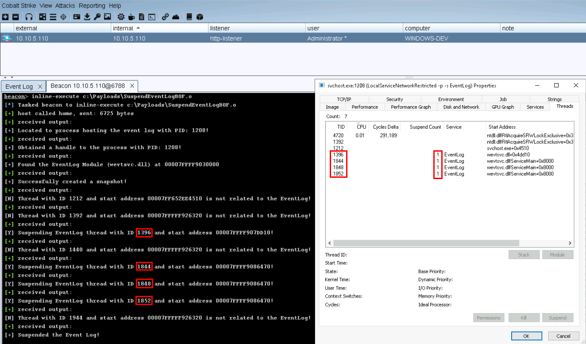

## SuspendEventLogBOF

Beacon Object File to locate and suspend the threads hosting the Event Log service. Utilizes syscalls via [InlineWhispers](https://github.com/outflanknl/InlineWhispers).

Code adapted from [ired.team](https://www.ired.team/offensive-security/defense-evasion/disabling-windows-event-logs-by-suspending-eventlog-service-threads)

**Note:** Admin privileges are required to run this BOF!

### How To Compile
```
$ git clone https://github.com/nick-frischkorn/SuspendEventLogBOF.git && cd SuspendEventLogBOF/src
$ x86_64-w64-mingw32-gcc -c eventLogBOF.c -o SuspendEventLog.o -masm=intel
[OR]
$ git clone https://github.com/nick-frischkorn/SuspendEventLogBOF.git && cd SuspendEventLogBOF/src
$ x86_64-w64-mingw32-gcc -c eventLogBOF.c -o SuspendEventLog.o -masm=intel -Wall -DBOF
$ x86_64-w64-mingw32-strip --strip-unneeded SuspendEventLog.o
```
### Usage
```
beacon> inline-execute c:\path-to-bof\SuspendEventLog.o
```
### To Do
Upgrade to dynamically resolving syscall numbers and jumping to syscall instructions within ntdll.dll

Clean up the header files and delete the unused structs

### Example

